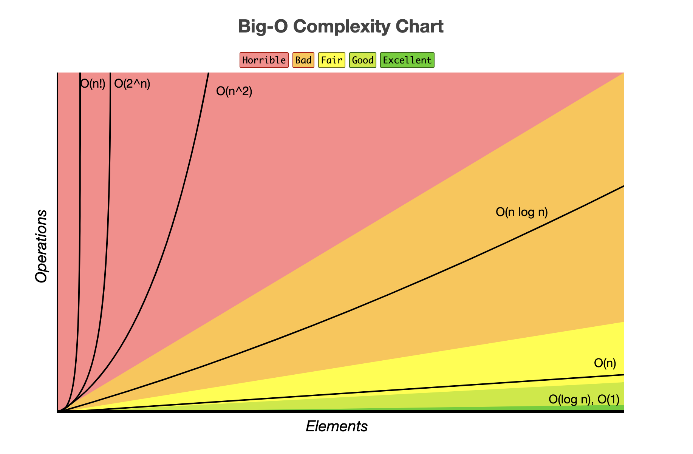

# Big O

Big O allows us to determine the complexity of an algorithm in an objective manner (Hardware Independent).

Each algorithm can handle accessing, searching, sorting, inserting, or deleting items at it's own unique **time** and **space** complexity.

Here's another way to think about space and time complexity

- **Time Complexity:** The number of steps it takes to complete the algorithm.

- **Space Complexity:** The amount of memory the algorithm uses to execute.

<!-- Memory isn't a huge issue nowadays, because of how advanced our machines have become. Even the smallest computers have Gigabytes of memory. -->
When we look at an algorithm's Big O, we're trying to see what the worst-case scenario is .

## Big O Notation Chart

| Big O Notation |     Name     | Example(s)                                                                                              |
| :------------ | :----------: | -------------------------------------------------------------------------------------------------------- |
|      O(1)      |   Constant   | 1.a) Find out if number is odd or even. <br/> 1.b) Getting a value from a hash when you know the key.     |
|    O(log n)    | Logarithmic  | 2) Finding an element in an unsorted array (Binary Search)                                                      |
|      O(n)      |    Linear    | 3.a) Finding max element in unsorted array <br/> 3.b) Find duplicate elements in array by making a hash map. |
|   O(n log n)   | Linearithmic | 4) Sorting Elements in an array with Merge Sort                                                              |
|     O(n^2)     |  Quadratic   | 5.a) Find Duplicate elements in array _(naïve)_ <br/> 5.b) Sorting elements in an array (Bubble Sort)        |
|     O(n^3)     |    Cubic     | 6) multi-variable equation solver                                                                            |
|     O(2^n)     | Exponential  | 7) Finding all subsets in a set                                                                              |
|     O(n!)      |  Factorial   | 8) Find all permutations of a given set/string                                                               |



## O(1) Constant Time

### Key takeaway: Constant time does not depend on the size of the input 🗝

### 1.a) Determine if a Number is Divisible by Another Number

This method takes a number. If the number is even it returns true, otherwise it returns false.

```JS
// This method takes a number. 
// If the number is divisible by 2, return true else return false.
const isNumberEven = num => num % 2 == 0 ? true : false;

isNumberEven(4); // => TRUE
isNumberEven(3); // => FALSE
```

We can make this more dynamic using closures.

```JS
// This method takes a number and sets it as the base
const isDivisibleBy = baseNum => {
    // This returns a function that takes another number (secondNum)
    return function(secondNum) {
        // If the second number can be divided by our base number return true
        // otherwise, return false
        return secondNum % baseNum == 0 ? true : false;
    }
};

// Now we can make a method that checks if a number is divisible by 3
const isDivisibleByThree = isDivisibleBy(3);

isDivisibleByThree(6); // => TRUE
isDivisibleByThree(4); // => FALSE
```

#### 1.b) Accessing Information in a Hash

The following data structure has many names(Dictionary, Hash, Object).

Here's an **accounts** hash, where the key is a username, and the value is the account number.

```JS
const accounts = {
    erin: 716421352634,
    rhys: 96714289,
    maia: 24302854231,
    // ...10,000,010 elements
    dillon: 15842362343
};

// We can access a value in a hash like this:
accounts[maia] // => 24302854231
```

Accessing any account number is constant time.

No matter how many items we have in the accounts hash, we can access an account number if we know the key.

---

## O(log n) Logarithmic Time

### Key takeaway: A logarithmic algorithm does not need to access all the elements of its input in order to find the solution 🗝

### 2) Finding an Element in a Sorted Array using a Recursive Binary Search

We'll search for a number in an array of sorted numbers.

```JS
// Array of sorted numbers.
const numArr = [2, 5, 11, 21, 37, 43, 58, 63];

// this method will find a number in a sorted array
const findNumber = (arr, targetNum, offset = 0) => {
    // If the array has no elements in it, return 0
    if (arr.length <= 0) return 0;

    // Grab the index that represents the number in the middle of the array.
    const half = Math.floor(arr.length / 2);

    // set our "urrent number" as the item in the middle of the array
    const currentNum = arr[half];

    // If our current number is the same as our target number
    if(currentNum === targetNum) {
        // return that index
        return offset + half;
        // If the target number is greater than our current number
    } else if(targetNum > currentNum) {
        // grab the right half of the array
        const right = arr.slice(half);
        // call findNumber on the right half of the array
        return findNumber(right, targetNum, offset + half);
    } else {
        // grab the left half of the array
        const left = arr.slice(0, half);
        // call findNumber on the left half of the array
        return findNumber(left, targetNum, offset);
    };
};

// Call findNumber method
findNumber(numArr, 58); // => 6, because 58 is at index 6

```

---

## O(n) Linear Time

### Key Takeaway: A linear algorithm's runtime increases when the size of the input increases 🗝

### 3.a) Finding Max Element in an Unsorted Array

This method will take an unsorted array of numbers, then return the largest number.

```JS
// Array of unsorted numbers.
const numArr = [11, 5, 37, 21, 8, 43, 2];

// Method takes array and returns the largest number.
const findMaxNum = arr => {
    // Set the max number in the array to zero
    maxNum = 0;
    // If the array has no elements, return zero
    if (arr.length <= 0) return maxNum;

    // Loop through the array
    for (let i = 0; i < arr.length; i++) {
        // if the current number is greater than maxNum
        if (arr[i] > maxNum) {
            // set maxNum to that number
            maxNum = arr[i];
        };
    };

    // return the maximum number
    return maxNum;
};
// call the findMaxNum function and pass it our array of numbers
findMaxNum(numArr); // => 43
```

### 3.b) Find Duplicate Elements in an Array using a Hash Map

We'll look for duplicates in an array of names

```JS
// Array of names.
const namesArr = ["Leo", "Percy", "Piper", "Control", "Saul", "Leo", "Jason"];

// This method takes an array of names and returns a hash with all the names that
const hasDuplicates = arr => {
    // Create an empty hash
    let duplicates = {};
    // loop throigh the array
    for (let i = 0; i < arr.length; i++) {
        const name = arr[i]
        // if the value exsists as a key in our duplicates hash, return true
        if (duplicates[`${name}`] == 1) return true;

        // create the key value pair in our duplicates hash
        duplicates[`${name}`] = 1;
    };
    // return false, we've gotten through the whole array and we didn't find any duplicates
    return false;
};

// call method
hasDuplicates(namesArr); // => true
```
<!-- We can do this another way where we increment the value in that hash, and return the hash so that the user can see all the names, and their count. -->

---

## O(n log n) Linearithmic Time

### Key Takeaway: An algorithm that compares two or more elements in a list of data will have a linearithmic runtime (at the very least)  🗝

### 4) Sort Elements in an Array using Merge Sort

This time we'll construct two methods! One to sort the array, and one to merge the array. Our sorting method will call our merge method.

Our array will be sorted in ascending order

```JS
// Array of unsorted numbers.
const numArr = [11, 5, 37, 21, 8, 43, 2];

const sortArr = (arr = []) => {
    const size = arr.length;
    // if there're less than two items in the array
    if (size < 2) {
        // No need to sort it, just return that array.
        return arr;
    }
    // If there's just two elements in the array
    if (size === 2) {
        // compare the two elements in the array
        // return a new array if the first element is larger than the second element
        // Otherwise, the array is already sorted. return the array.
        return arr[0] > arr[1] ? [arr[1], arr[0]] : arr;
    }
    // grab the mid point of the array
    const mid = Math.floor(size / 2, 10);
    // split and merge
    return mergeArr(sortArr(arr.slice(0, mid)), sortArr(arr.slice(mid)));
};
// This method will merge elements from two arrays in ascending order
const mergeArr = (arr1 = [] , arr2 = []) => {
    // create an empty array 
    const merged = [];
    // grab the first items in each array
    let arr1Index = 0;
    let arr2Index = 0;

    // While we are not at the end of both arrays
    while (arr1Index < arr1.length || arr2Index < arr2.length) {
        // if array 1's index is greater than or equal to the length of array 1
        // OR the element in array 1 at arr1Index is greater than the element in array 2 at arr2Index
        if (arr1Index >= arr1.length || arr1[arr1Index] > arr2[arr2Index]) {
            // that means the element in array 2 at index arr2Index has the lowest value.
            // We will push that element into our "merged" array
            merged.push(arr2[arr2Index]);
            // increment the index for array 2
            arr2Index++;
        } else {
            // ELSE
            // that means the element in array 1 at index arr1Index has the lowest value.
            // We will push that element into our "merged" array
            merged.push(arr1[arr1Index]);
            // increment the index for array 1
            arr1Index++;
        };
    };
    // return our merged array
    return merged;
};

sortArr(numArr);

```

---

## O(n^2) Quadratic Time

### Key Takeaway: We're getting into dangerous territory. Nested loops. 🗝

At the worst case scenario, we have to loop through each element in the array, twice, to get to our solution 🤢

### 5.a) Find Duplicate Elements in an Array (Naive/Brute Force solution)

```JS
// Array of names.
const namesArr = ["Leo", "Percy", "Piper", "Control", "Saul", "Leo", "Jason"];

// method checks array for duplicates
const hasDuplicates = arr => {
    // loop through the array
    for (let outter = 0; outter < arr.length; outter++) {
        // for each item in the array
        // loop through the array
        for (let inner = 0; inner < arr.length; inner++) {
            // If the outter loop and the inner loop are at the same index, continue
            if(outter === inner) continue;
            // if the outer element is the same as the inner element, return true
            if(arr[outter] === arr[inner]) {
                return true;
            };
        };
    };
    // return false, we've gotten through the whole array and we didn't find any duplicates
    return false;
};

// call method
hasDuplicates(namesArr); // => true

```

<!-- We can do this another way where we push the duplicate names in an array, and return that array so the user can see all the duplicate names -->

### 5.b) Sorting Elements in an Array using Bubble Sort

We'll try to sort the array using Bubble Sort

```JS
// Array of unsorted numbers.
const numArr = [11, 5, 37, 21, 8, 43, 2];

// Method to sort an array
function sortArr(arr) {
    // loop through the array
    for (let outer = 0; outer < arr.length; outer++) {
        // make a variable to reference the outer item in the array
        let outerElement = arr[outer];
        // Loop through the array
        for (let inner = outer + 1; inner < arr.length; inner++) {
            // make a variable to reference the inner item in the array
            let innerElement = arr[inner];
            // if the outer element is greater than the inner elment
            if(outerElement > innerElement) {
                // swap the actual items in the array
                arr[outer] = innerElement;
                arr[inner] = outerElement;
                // update references to the items in the array
                outerElement = arr[outer];
                innerElement = arr[inner];
            }
        }
    }
  // return the sorted array
  return arr;
}
// call our functuon
sortArr(numArr);
```

<!-- ---

## O(n^3) Cubic Time

### 6)

```JS

```

---

## O(2^n) Exponential Time

### 7)

```JS

```

---

## O(n!) Factorial Time

### 8)

```JS

``` -->
